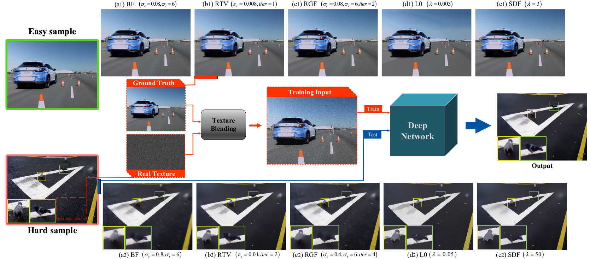

### Easy2Hard: Learning to Handle the Intractables from a Synthetic Dataset for Structure-preserving Image Smoothing
A work by Yidan Feng as a master student in Nanjing University of Aeronautics and Astronautics (NUAA). The author is now working as a PhD student in the Hong Kong Polytechnic University.

### Introduction

Image smoothing is a prerequisite for many computer vision and graphics applications. In this paper, we raise an intriguing question whether a dataset that semantically describes meaningful structures and unimportant details, can facilitate a deep learning model to smooth complex natural images. To answer it, we generate ground-truth labels from easy samples by candidate generation and a screening test, and synthesize hard samples in structure-preserving smoothing by blending intricate and multifarious details with the labels. To take full advantage of this dataset, we present a joint edge detection and structure-preserving image smoothing neural network, which we call JESS-Net for short. Moreover, we propose the distinctive total variation loss as a prior knowledge to narrow the gap between synthetic and real data. Experiments on different datasets and real images show clear improvements of our method over the state-of-the-arts in terms of both the image cleanness and structure-preserving ability.

### Sources

The following sources can be downloaded fron Google drive:
- dataset (tx updated): https://drive.google.com/drive/folders/1inuxV8ghABOv60KVc6zY97Ccj0yyJ9uv?usp=sharing   
- trained models for ablation study: https://drive.google.com/drive/folders/1EfgX-VDMOyuqRfJfjq7p11O4rKekXdaY?usp=sharing
- JESS100: https://drive.google.com/drive/folders/1EDqgjFZt5KndZlHjtD2EjpcXvfzT878s?usp=sharing
- trained model of our method (epoch 224_ssim 0.922825_psnr 31.733277): https://drive.google.com/file/d/1bDvOg9fM3r-qAvn-yVf38Y_umjt1E-kR/view?usp=sharing

### Usage
This code is tested with Python 3.7, Pytorch 1.3.1 and CUDA 10.1.
#### To test the trained model for structure-preserving image smoothing 
Download the trained model and put the model file in your model path.
Put your own test files in your test path.
```bash
python  show.py --modelPath YOURPATH/epoch 224_ssim 0.922825_psnr 31.733277 --test_dir YOURPATH --sessname SPS --net HDC_edge_refine 
````
#### To train from sratch:
##### First generate the SPS dataset
Download the ground-truth images and texture patterns from the above links.
Put the texture pattern into 'tx' directory, and put GTs into 'SPS-GT' directory. Both directories should be under the 'dataset utils'.
```bash
cd dataset_utils
python blend&conc.py
````
then wait for the dataset generation process to complete.
Next, randomly select a subset from the generated files in 'train' for cross validation.
```bash
python get_val.py
````
Then, put the 'train', 'val' and 'edge' directories into datasets/YOUR_DATASET_NAME/
##### Train
```bash
python train.py --sessname YOUR_SESSNAME --net HDR_edge_refine --train_dir './datasets/YOUR_DATASET_NAME/train' --val_dir './datasets/YOUR_DATASET_NAME/val' --edge_dir './datasets/YOUR_DATASET_NAME/edge'
````
### Citation

```BibTex
@article{feng2021easy2hard,
  title={Easy2Hard: Learning to Solve the Intractables From a Synthetic Dataset for Structure-Preserving Image Smoothing},
  author={Feng, Yidan and Deng, Sen and Yan, Xuefeng and Yang, Xin and Wei, Mingqiang and Liu, Ligang},
  journal={IEEE Transactions on Neural Networks and Learning Systems},
  year={2021},
  publisher={IEEE}
}
```


